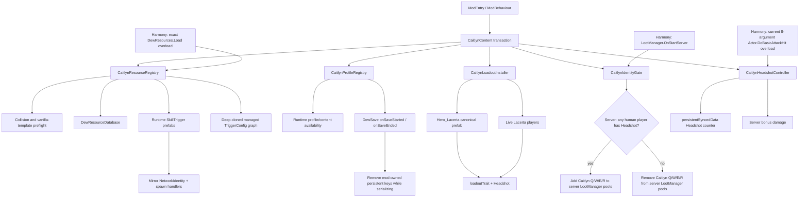

# Caitlyn Identity PoC Architecture

## Goal

Use Lacerta's existing Traveler lifecycle as the host and turn a custom Identity Memory into the switch that enables a Caitlyn-specific content set.

Phase 0 validates content plumbing and one minimal real Headshot mechanic. It does not register a new Traveler.



## Runtime content

| Slot | Runtime type | Phase 0 proxy |
|---|---|---|
| Identity | `St_D_CaitlynHeadshot` | `St_D_DoubleTap` plus custom Headshot controller |
| Q | `St_Q_CaitlynPiltoverPeacemaker` | `St_Q_HandCannon` |
| W | `St_W_CaitlynYordleSnapTrap` | `St_Q_HandCannon` |
| E | `St_E_Caitlyn90CaliberNet` | `St_R_QuickTrigger` |
| R | `St_R_CaitlynAceInTheHole` | `St_R_PrecisionShot` |

The proxy owns a deep-cloned managed `TriggerConfig` graph. Mutable cast/channel/prediction/validator state is isolated from vanilla resources. `UnityEngine.Object` references are intentionally shared, allowing the proxy to borrow existing animation, audio, effect and ability assets without mutating them.

A missing vanilla proxy template, a missing/null `TriggerConfig`, or mutable configuration sharing aborts registration. The PoC therefore cannot report a successful load while silently producing an uncastable proxy Memory.

## Registration transaction

Runtime content registration is fail-closed:

1. Preflight custom GUIDs, runtime types and generated Mirror asset IDs.
2. Refuse to overwrite existing `DewResourceDatabase` mappings.
3. Require each vanilla proxy template and its `TriggerConfig` data.
4. Create runtime prefabs and Mirror spawn handlers.
5. Add Dew resource mappings.
6. Reinitialize the runtime database and verify mutable config isolation.
7. If any step fails, unregister handlers, remove only mappings owned by this mod, destroy created prefabs and reinitialize the database.

The outer `CaitlynContent` lifecycle is also transactional. A later failure in profile/loadout/gate initialization triggers cleanup of every earlier subsystem. `ModEntry` removes Harmony patches when startup fails.

## Profile and save isolation

The running game needs the custom type names in profile/content availability structures so the Memories are not rejected as unavailable content. Those values are runtime-only.

`CaitlynProfileRegistry` records only keys it inserted. It requires `DewSave.onSaveStarted` and `DewSave.onSaveEnded`; if those hooks are unavailable, profile registration fails rather than risking save pollution.

```text
runtime profile contains Caitlyn keys
        ↓
onSaveStarted
        ↓
remove mod-owned persistent keys
        ↓
game serializes profile/stat data
        ↓
onSaveEnded
        ↓
restore runtime-only entries
```

Unload removes the same mod-owned entries and save hooks. If another system creates the same key during the save window, this registry relinquishes ownership instead of deleting that external value later.

## Lacerta loadout ownership

The installer touches only the canonical `Hero_Lacerta` resource and currently live Lacerta heroes in `DewPlayer.gamePlayers`. On unload it removes only the Caitlyn Headshot GUID from `loadoutTrait`, preserving unrelated changes from other mods.

## Headshot Phase-0 path

The installed Shape of Dreams build `6000.0.58f2 (92dee566b325)` exposes the current method as:

```text
Actor.DoBasicAttackHit(
    Actor,
    Entity from,
    Entity to,
    bool isCriticalHit,
    bool isMain,
    float damage,
    float attackEffect,
    ActionRef<DamageData> onBeforeDispatch)
```

Harmony patches that exact overload. The controller receives `to` as the hit target and accepts only server-side heroes with Headshot equipped and `isMain == true`.

The counter lives in `Actor.persistentSyncedData`. Every fifth qualifying hit adds experimental bonus damage. The counter resets only after the bonus `DealDamage` call returns. Shape of Dreams uses a normalized decimal for crit chance in its runtime stat model; the PoC clamps `hero.Status.critChance` directly to `0..1`, with debug output retained for in-game validation.

## Runtime Mirror compatibility

The tested game Mirror DLL contains the non-public `NetworkIdentity._assetId` field and `InitializeNetworkBehaviours` method. It does **not** contain `_isSceneObject`.

Runtime prefabs therefore set `_assetId` through reflection and set public `sceneId = 0`, which is consistent with Mirror's distinction between scene objects and runtime prefab objects. Registration fails loudly if `_assetId` or `InitializeNetworkBehaviours` disappears in a future game build. Mirror's own documentation describes Scene Id as the identifier for scene-hierarchy network objects, while runtime-spawned prefabs are identified by Asset Id.

## Intentional gameplay scope

`LootManager` owns server-wide skill pools. Phase 0 intentionally gates Caitlyn Q/W/E/R at run/team level: if any human player equips Headshot, the four Memories may enter the shared pool. Once generated, those Memories are not restricted to the Caitlyn Identity player. Player-exclusive pickup/use filtering is out of scope and is not required for this mod design.

## Assets

No model, animation, icon, VFX or audio bundle is committed in Phase 0. The future asset layer should have an explicit manifest containing source, author, license/permission and redistribution status for every binary asset.

## Planned phases

### Phase 1 — real combat kit

- Q line projectile / penetration behavior.
- E projectile + recoil displacement.
- W placeable trap + root/mark state.
- R channel/target lock + long-range single-target shot.
- Extend Headshot with trap/net target interactions.

### Phase 2 — presentation

- Caitlyn icon and Memory icons.
- Model/skin attachment to Lacerta's Hero instance.
- Animator/AnimationClip mapping.
- VFX and SFX.
- Localization and tooltips.

### Phase 3 — multiplayer hardening

- Join-in-progress.
- Host/client hot-load constraints.
- Network state for traps and R target lock.
