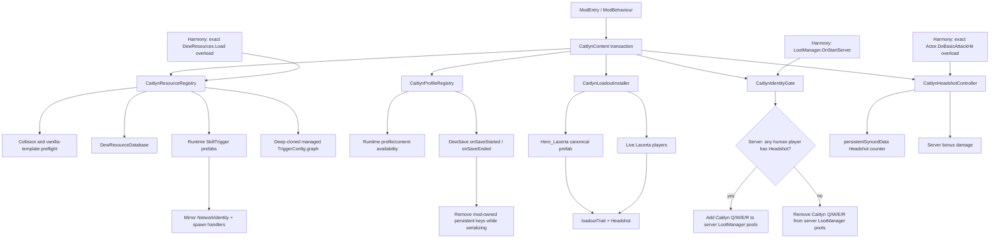

# Caitlyn Identity PoC Architecture

## Goal

Use Lacerta's existing Traveler lifecycle as the host and turn a custom Identity Memory into the switch that enables a Caitlyn-specific content set.

Phase 0 validates content plumbing and one minimal real Headshot mechanic. It does not register a new Traveler.



## Runtime content

| Slot | Runtime type | Phase 0 proxy |
|---|---|---|
| Identity | `St_D_CaitlynHeadshot` | `St_D_DoubleTap` plus custom Headshot controller |
| Q | `St_Q_CaitlynPiltoverPeacemaker` | `St_Q_HandCannon` |
| W | `St_W_CaitlynYordleSnapTrap` | `St_Q_HandCannon` |
| E | `St_E_Caitlyn90CaliberNet` | `St_R_QuickTrigger` |
| R | `St_R_CaitlynAceInTheHole` | `St_R_PrecisionShot` |

The proxy owns a deep-cloned managed `TriggerConfig` graph. Mutable cast/channel/prediction/validator state is isolated from vanilla resources. `UnityEngine.Object` references are intentionally shared, allowing the proxy to borrow existing animation, audio, effect and ability assets without mutating them.

A missing vanilla proxy template, a missing/null `TriggerConfig`, or mutable configuration sharing aborts registration. The PoC therefore cannot report a successful load while silently producing an uncastable proxy Memory.

## Registration transaction

Runtime content registration is fail-closed:

1. Preflight custom GUIDs, runtime types and generated Mirror asset IDs.
2. Refuse to overwrite existing `DewResourceDatabase` mappings.
3. Require each vanilla proxy template and its `TriggerConfig` data.
4. Create runtime prefabs and Mirror spawn handlers.
5. Add Dew resource mappings.
6. Reinitialize the runtime database and verify mutable config isolation.
7. If any step fails, unregister handlers, remove only mappings owned by this mod, destroy created prefabs and reinitialize the database.

The outer `CaitlynContent` lifecycle is also transactional. A later failure in profile/loadout/gate initialization triggers cleanup of every earlier subsystem. `ModEntry` removes Harmony patches when startup fails.

## Profile and save isolation

The running game needs the custom type names in profile/content availability structures so the Memories are not rejected as unavailable content. Those values are runtime-only.

`CaitlynProfileRegistry` records only keys it inserted. It requires `DewSave.onSaveStarted` and `DewSave.onSaveEnded`; if those hooks are unavailable, profile registration fails rather than risking save pollution.

```text
runtime profile contains Caitlyn keys
        ↓
onSaveStarted
        ↓
remove mod-owned persistent keys
        ↓
game serializes profile/stat data
        ↓
onSaveEnded
        ↓
restore runtime-only entries
```

Unload removes the same mod-owned entries and save hooks. If another system creates the same key during the save window, this registry relinquishes ownership instead of deleting that external value later.

## Lacerta loadout ownership

The installer does not scan `Resources.FindObjectsOfTypeAll<HeroSkill>()` or restore a whole snapshot. It touches only:

- the canonical `Hero_Lacerta` resource;
- currently live Lacerta heroes in `DewPlayer.gamePlayers`.

On unload it removes only the Caitlyn Headshot GUID from `loadoutTrait`. Unrelated changes made by other mods while Caitlyn is loaded are preserved.

## Headshot Phase-0 path

Headshot is driven from the exact `Actor.DoBasicAttackHit(Entity, bool, bool, float, float)` overload. The controller accepts only server-side heroes with Headshot equipped and only `isMain` hits.

The counter lives in `Actor.persistentSyncedData`. Every fifth qualifying hit adds experimental bonus damage. The counter resets only after the bonus `DealDamage` call returns.

Shape of Dreams uses a normalized decimal for crit chance in its runtime stat model; the PoC therefore clamps `hero.Status.critChance` directly to `0..1`. The debug log retains the raw and clamped values for the first real-game validation.

## Why this shape

The experiment separates five failure domains:

1. **Resource registration** — can brand-new `SkillTrigger` types resolve through `DewResources` without colliding with existing content?
2. **Lobby/loadout integration** — can a new Identity appear for Lacerta without a new Hero type and unload without overwriting unrelated loadout changes?
3. **Save isolation** — can custom runtime unlock metadata exist without being serialized into a clean profile?
4. **Run integration** — can the Identity dynamically control which custom Memories enter loot generation?
5. **Networking/gameplay** — can runtime skill prefabs and the server-owned Headshot state/damage path work under Mirror?

Only after these paths are stable should Q/W/E/R receive custom `AbilityInstance`, projectile, trap, displacement, channel, VFX and audio implementations.

## Known architectural limits

### Team-wide identity gate

`LootManager` owns server-wide skill pools. Phase 0 gates the pool at run/team level. If any human player has Headshot equipped, the four Caitlyn Memories can be generated by the shared loot system.

Player-exclusive eligibility needs a later hook where the interacting/picking-up Hero is known, or a custom interaction rule that rejects/redirects Caitlyn Memories for heroes without the Caitlyn Identity. This is kept out of the resource-registration PoC so player eligibility cannot mask lower-level content-loading failures.

### Runtime Mirror compatibility

The custom skill types retain the community-used `MirrorProcessed()` marker, but the project does not treat that marker as a guarantee. The runtime helper depends on the current Mirror `NetworkIdentity` private fields `_assetId`, `_isSceneObject` and method `InitializeNetworkBehaviours`. If those internals are absent, registration fails loudly and the content transaction rolls back.

### Assets

No model, animation, icon, VFX or audio bundle is committed in Phase 0. The future asset layer should have an explicit manifest containing source, author, license/permission and redistribution status for every binary asset.

## Planned phases

### Phase 1 — real combat kit

- Q line projectile / penetration behavior.
- E projectile + recoil displacement.
- W placeable trap + root/mark state.
- R channel/target lock + long-range single-target shot.
- Extend Headshot with trap/net target interactions.

### Phase 2 — presentation

- Caitlyn icon and Memory icons.
- Model/skin attachment to Lacerta's Hero instance.
- Animator/AnimationClip mapping.
- VFX and SFX.
- Localization and tooltips.

### Phase 3 — multiplayer and eligibility hardening

- Per-player exclusive Memory eligibility.
- Join-in-progress.
- Host/client hot-load constraints.
- Network state for traps and R target lock.
